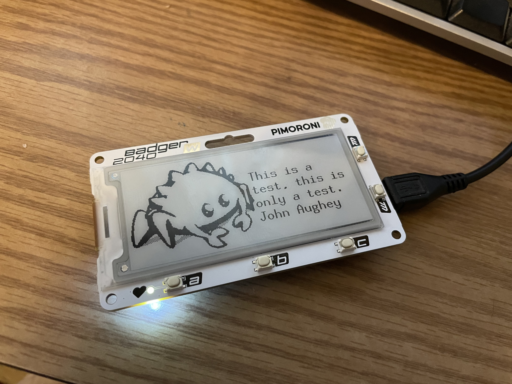
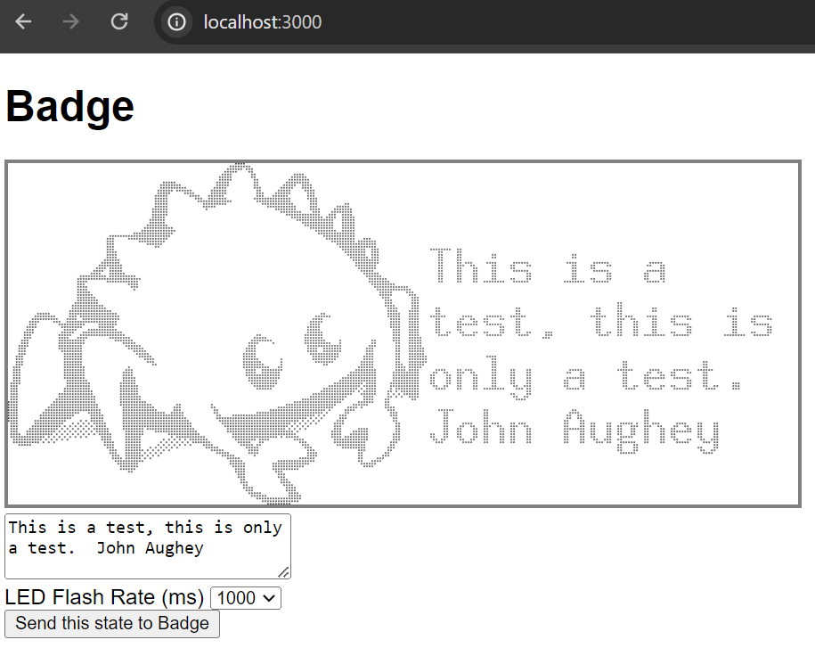

# badge_system

# Aside

- Prototype phase
    - Can it do whatever
    - understanding hardware
    - understanding software
    - trying to get some implementation of kind of the expected operating capability
    - Doing whatever it takes.

- Badge
    - basic rust flash led
    - talk to display
    - talk to wifi
    - How to use embedded graphics crate
    - how to setup toolchains for embedded/wasm

- web
    - leptos Basic project
    - embedded graphics in a browser

- certs
    - How do we create self-signed certificates
    - Testing with openssl s_client and s_server


- Development experience
    - Project Management (design practices, PRO, gate reviews, design-code-test cycles, documentation, requirements definition)
    - People Management (version one, standups, code reviews, design reviews)
    - Development environment (IDE, dev-containers, testing env, build environment)
    - Development experience (workflow, build-test cycle, unit interaction, emulation)
    - Development Prototype (fast dev env standup/teardown)
    - Development Education (awareness of patterns, ability to leverage language capabilities)
    - Development Translation (lossly related to architecture design, less "what classes needed" more "what concepts will be most beneficial to the developer")
    - Coding conceptual abstractions (architecture, async/sync, language abstractions, language enforcement/constraints)
    - Artifact distribution (customer interaction, deployment mechanisms)
    - Execution Environments (operating environments)

# Capabilities

Two visible components, 

- a physical badge in the form of a Badger 2040W.
- a publicly accessible web page




## General functionality

- On web interface
    - Web page displays a preview rendering of what the badge should look like.
    - Text boxes to update the text of the badge.
    - Drop down control to change the period of the flashing LED.
    - Button to send this state to the badge.
- On the badge
    - Badge will initialize hardware and wifi
    - Obtain an IP address over wifi/dhcp to a pre-defined access point
    - Connect to the public server
    - Communicate with that server to receive badge updates
    - Badge update consist of
         - New text to display
         - Flash rate of the LED

# Narriative

The purpose of this is to showcase/demonstrate Rust running on multiple devices with a 100% rust codebase.  This will show rust running in a bare-metal no_std embedded configuration, a fully Linux hosted web server, and wasm on a web browser.  Additionally, a wide range of technologies will be utilitized such as encryption/authenticaion with TLS.

The expectation is that during the presentation, a QR code will be presented to direct attendees to a web site.  The web site will be the web interface, allowing them to make modifications to the badge I am wearing.  Changes will be sent to the badge in real-time, and the changes visible from the stage.  This will happen asynchronous to the presentation.  During the presentation, the capabilities being shown will be revealed - relevant to the content of the presentation.  For example, the presentation on multicore will highlight the fact that multiple cores are being used both on the server and embedded along with async development experience.

## Features

- Bare-metal environment
     - RP2040W microcontroller
     - Cortex-M0 processor (32-bit RISC ARM)
     - thumbv6m-none-eabi target [reduced instruction set encoding](https://stackoverflow.com/questions/28669905/what-is-the-difference-between-the-arm-thumb-and-thumb-2-instruction-encodings)
     - [Embassy asynchronous framework](https://embassy.dev/)
     - Async development/operating environment
     - Multi-core
     - no_std embedded tls library for authentication/encryption
- Web Client
    - [Leptos framework](https://leptos.dev/)
    - Rust code compiled to wasm
    - Preview display rendered with same code base
- Web Server
    - Leptos framework (same env as client)
    - Multi-threaded + async
    - Separate TLS stack for direct-badge comm (split https and badge-specific comm)
- Architecture
    - TLS 1.3 communication between badge and server
    - Badge authentication/revocation through Pki certificates
    - Encryption using TLS13_AES_256_GCM_SHA384, TLS13_AES_128_GCM_SHA256, or TLS13_CHACHA20_POLY1305_SHA256,
    - Web server TLS secure through nginx reverse proxy

# Constraints

- no_std environment
- constrainted stack size on rp2040 (2k)
- Allocation strategy on embedded
- Pulling as much dev out of embedded as possible

# Dev Run Notes

```
vscode ➜ /workspaces/badge_system (main) $ cargo run --release --package run-wasm -- --package basic_example
```

```
vscode ➜ /workspaces/badge_system/nginx (main) $ sudo nginx -p `pwd` -c ./nginx.conf 
```

```
vscode ➜ /workspaces/badge_system/web-badge (main) $ cargo leptos watch -- certs/CA_cert.crt  certs/server.crt certs/server.key
```

```
PS C:\jha\socat-1.7.3.2-1-x86_64> ./socat.exe TCP4-LISTEN:4444,fork,reuseaddr TCP4:127.0.0.1:4443
```

# nginx

https://nginx.org/en/docs/stream/ngx_stream_ssl_module.html

# Setting up aws

```
sudo yum update -y
sudo yum install -y docker
sudo service docker start
sudo usermod -a -G docker ec2-user
```

# Setting up letsencrypt

```
mkdir -p letsencrypt/etc
mkdir -p letsencrypt/var
docker run -it --rm --name certbot \
            -p 80:80 -p 443:443 \
            -v "$HOME/letsencrypt/etc:/etc/letsencrypt" \
            -v "$HOME/letsencrypt/var:/var/lib/letsencrypt" \
            certbot/certbot certonly

sudo curl -L https://github.com/docker/compose/releases/latest/download/docker-compose-$(uname -s)-$(uname -m) -o /usr/local/bin/docker-compose
sudo chmod +x /usr/local/bin/docker-compose
```

```
docker build -t aughey/webbadge:latest .
docker push aughey/webbadge:latest

docker run -p 3000:3000 --rm -it aughey/webbadge:latest
```

https://docs.pingidentity.com/r/en-us/solution-guides/htg_use_openssl_to_test_ssl_connectivity